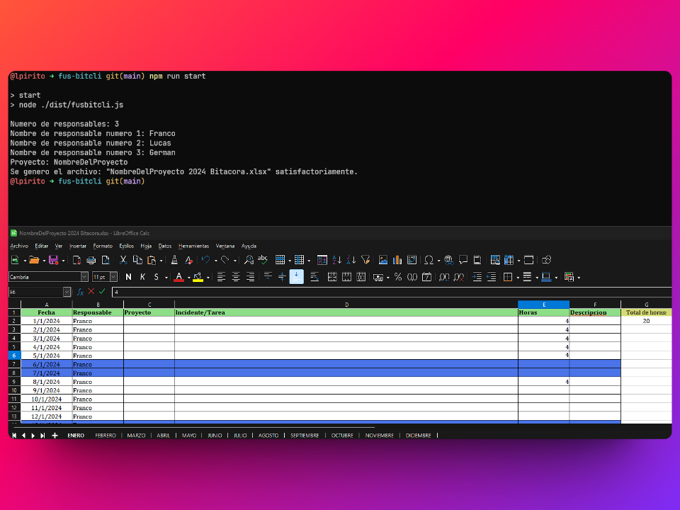

# fus-bitcli

Herramienta CLI para generar bitacoras diarias para Fusap

# Como utilizar

## Pre-requisitos

- Tener instalada la ultima version de [node](https://nodejs.org/en) LTS.
- Clonar el proyecto y ejecutar `npm install` dentro de la carpeta del proyecto.

### Sin compilar

*Para no tener que compilar el proyecto, subo la carpeta `/dist` que contiene el programa compilado (**fusbitcli.js)***

1. Dentro de la carpeta del proyecto ejecutar: `npm run start` dentro de la carpeta del proyecto.

### Con compilacion

Si les interesa hacer pruebas, para compilar el proyecto tienen que:

1. Dentro de la carpeta del proyecto ejecutar `npm run build` dentro de la carpeta del proyecto.